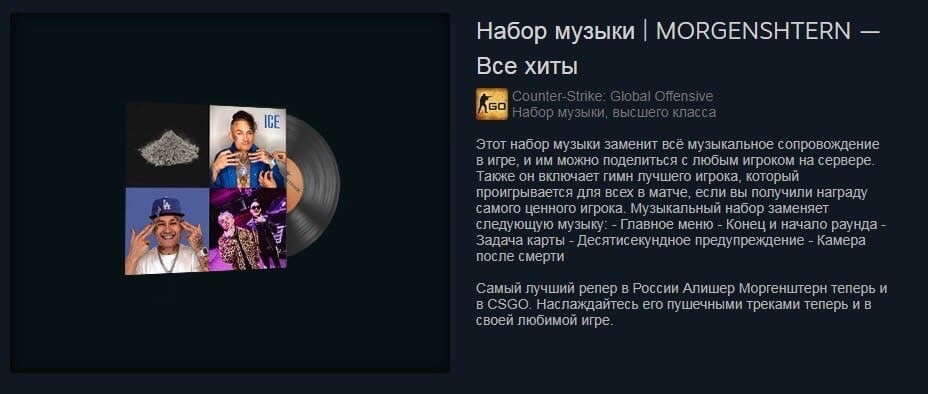

# Morgenshtern CS:GO soundpack

Lua script for [kamidere.moe](https://kamidere.moe/).

### Information
Sounds will be played in voice chat.

Sounds should be located in `C:/kamidere/Sounds`.  

[Sounds path](Sounds) contains converter which requires [ffmpeg](https://ffmpeg.org/).  
Just drag and drop audio to `convert.bat`.

### Events
* onKill
* onRifle - equip any rifle
* onExplosion - on C4 explosion

### Current sounds
* [onKill](Sounds/onKill.wav) - ПОСОСИ
* [onRifle](Sounds/onKill.wav) - ДА СУКА НОВЫЙ АВТОМАТ
* [onExplosion](Sounds/onKill.wav) - СЛАВА ЧТО ТЫ СДЕЛАЛ